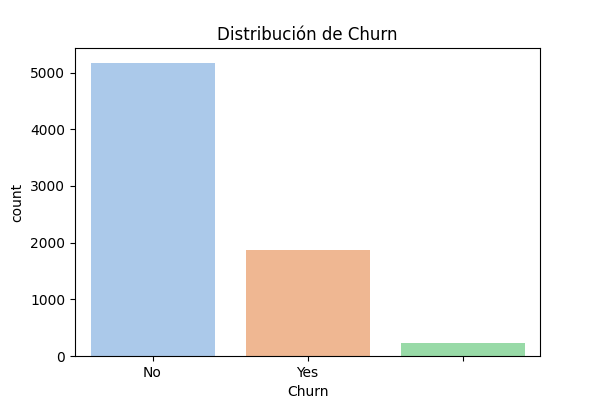
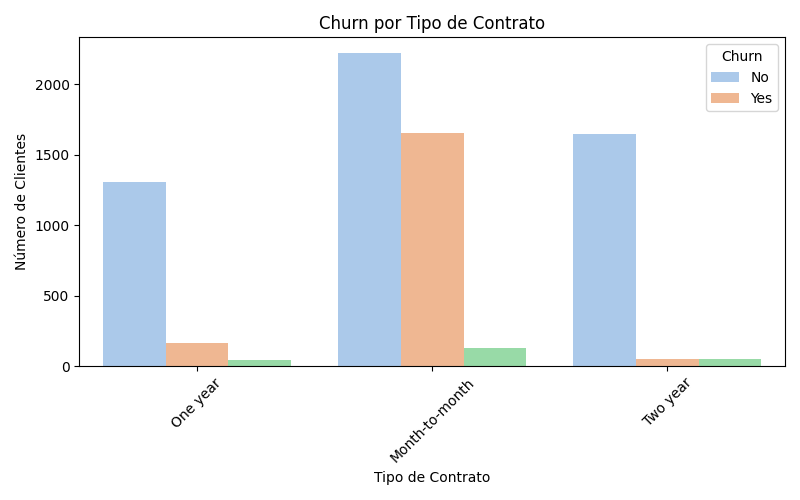
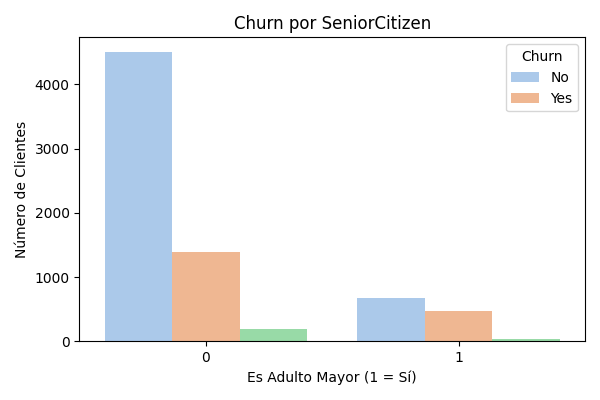

# Telecom X – Análisis de Evasión de Clientes (Churn)

## Propósito

Este proyecto forma parte del desafío de Data Science para **Telecom X**. El objetivo principal es comprender los factores que afectan la *evasón de clientes* (“churn”) en la empresa y proveer insights que permitan diseñar estrategias para retenerlos. Para ello se realiza un análisis exploratorio de datos (EDA) utilizando un dataset obtenido desde una API en formato JSON y se generan visualizaciones que resaltan patrones y tendencias. Los resultados de este análisis servirán de base para futuros modelos predictivos de churn.

## Estructura del proyecto

```
telecom-x-churn-analysis/
├── data/           # Datos sin procesar y conjuntos limpios
│   └── TelecomX_Data.json
├── notebooks/      # Notebooks de Jupyter con el análisis
│   └── TelecomX_EDA.ipynb
├── src/            # Scripts y funciones auxiliares (ETL, visualización, etc.)
├── images/         # Gráficos utilizados en el README y el informe
└── README.md       # Descripción general del proyecto
```

- `data/`: contiene el archivo `TelecomX_Data.json` descargado desde la API de GitHub.
- `notebooks/`: incluye el notebook `TelecomX_EDA.ipynb` donde se desarrolla el análisis exploratorio.
- `src/`: carpeta pensada para scripts de extracción, transformación y carga (ETL) y funciones reutilizables.
- `images/`: almacena gráficos de interés generados durante el EDA.
- `README.md`: este documento.

## Extracción y carga de datos

Los datos se obtienen directamente desde el repositorio proporcionado por el desafío mediante la función `pd.read_json` y posteriormente se normalizan con `pd.json_normalize` para aplanar la estructura anidada de la API. El dataset contiene **7 267** registros y **21** variables; la columna `account_Charges_Total` se convierte a numérica para facilitar su análisis.

## Exploración y visualizaciones

A continuación se muestran algunas visualizaciones generadas durante el EDA.  Estas gráficas ayudan a comprender la distribución del churn y su relación con variables de interés.

### Distribución de churn



La mayoría de los clientes (≈71 %) no se han dado de baja, mientras que alrededor del 26 % han abandonado la empresa.

### Churn por tipo de contrato



Los contratos “Month‑to‑month” muestran una mayor proporción de cancelaciones en comparación con los contratos de uno o dos años, lo que sugiere que los compromisos más largos reducen la probabilidad de churn.

### Churn por clientes adultos mayores



Los clientes mayores de 65 años (`SeniorCitizen = 1`) tienen una tasa de churn ligeramente superior a los clientes más jóvenes.

Además de estas variables, también se analizan otras características como el tipo de servicio de internet, la presencia de servicios adicionales (seguridad en línea, copias de seguridad, streaming) y el método de pago. Estas variables muestran patrones que podrían ser útiles en modelos predictivos posteriores.

## Cómo ejecutar el notebook

1. Clonar este repositorio:
   ```bash
   git clone https://github.com/TeruIshijo1/telecom-x-churn-analysis.git
   cd telecom-x-churn-analysis
   ```
2. Instalar las dependencias principales (por ejemplo, `pandas`, `matplotlib`, `seaborn`, `numpy`). Se recomienda usar un entorno virtual:
   ```bash
   pip install pandas matplotlib seaborn numpy jupyter
   ```
3. Descargar el archivo `TelecomX_Data.json` en la carpeta `data/` si no está presente (el enlace está en el notebook).
4. Ejecutar el notebook de análisis:
   ```bash
   jupyter notebook notebooks/TelecomX_EDA.ipynb
   ```
   o abrirlo en JupyterLab para explorar las celdas paso a paso.

## Conclusiones provisionales

A partir de la exploración inicial, se observan patrones como:

- **Duración del contrato y churn:** los clientes con contratos de corto plazo (mes a mes) tienen mayor probabilidad de churn.
- **Métodos de pago electrónicos:** ciertos métodos (por ejemplo, cheques electrónicos) están asociados a tasas de churn más elevadas.
- **Servicios adicionales:** la contratación de servicios como seguridad en línea, protección de dispositivos o soporte técnico tiende a reducir la evasión.

Estos hallazgos sirven como punto de partida para construir modelos predictivos más robustos y diseñar estrategias de retención.
